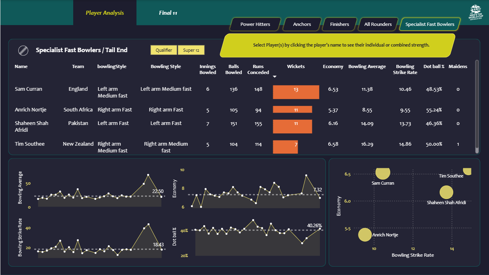

# 🏏 Cricket Analysis — ICC T20 World Cup 2022

## 📖 Overview
This project presents an **end-to-end Cricket Data Analytics Pipeline** built around the **ICC T20 World Cup 2022**.  
It combines **web scraping, data preprocessing, analytics, and visualization** to identify the **Best T20 Playing XI** based on real match performances.

The pipeline scrapes data from **ESPN Cricinfo** using **Bright Data**, processes it with **Python (Pandas)**, and visualizes key insights in an interactive **Power BI Dashboard**.

---

## 🎯 Project Goals
To extract, clean, and analyze cricket match data and derive **data-driven insights** such as:
- 🧩 Player performance metrics
- ⚡ Strike rates and economy comparisons
- 🥇 Selection of the **Best Playing XI** for the T20 World Cup 2022

---

## ⚙️ Data Pipeline Overview

### **1️⃣ Data Collection (Web Scraping)**
- Source: [ESPN Cricinfo](https://stats.espncricinfo.com/)
- Tool: **Bright Data Web Scraper**
- Scripts:
  - `match_results.js` — Match result links
  - `batting_summary.js` — Player batting data
  - `bowling_summary.js` — Player bowling data
  - `player_info.js` — Player profiles

### **2️⃣ Data Preprocessing**
- Environment: **Python (Jupyter Notebook)**
- Libraries: `pandas`, `numpy`, `matplotlib`
- Tasks performed:
  - Cleaning inconsistent JSON data
  - Merging multiple match datasets
  - Calculating advanced cricket metrics (SR, Avg, Economy, Boundary %)
  - Exporting to CSV for visualization

### **3️⃣ Data Visualization**
- Tool: **Microsoft Power BI**
- Dashboard Features:
  - Top Batters & Bowlers by KPIs
  - Player role segmentation (Opener, Finisher, All-rounder, Bowler)
  - Interactive filters for team, role, and performance stats
  - Final **Best XI** visualization with player images

---
## 📷 Dashboard Preview

### Power Hitters

### Anchors

### Finishers

### All Rounders

### Fast Bowlers

### Final 11

---

## 🏆 Key Performance Indicators (KPIs)

### **Batting Metrics**
| Metric | Description |
|:--|:--|
| **Strike Rate (SR)** | Runs scored per 100 balls faced |
| **Boundary %** | % of balls faced that resulted in 4s or 6s |
| **Average** | Runs per dismissal |
| **Balls Faced** | Measure of consistency and opportunity |
| **Matches Played** | Used to normalize performance |

### **Bowling Metrics**
| Metric | Description |
|:--|:--|
| **Bowling Average** | Runs conceded per wicket |
| **Economy Rate** | Runs conceded per over |
| **Wickets Taken** | Indicator of match impact |

---

## 🧠 Selection Logic — *Building the Best XI*

| Player Role | Selection Criteria |
|:--|:--|
| **Top Order** | High SR, Boundary %, and consistency |
| **Middle Order / Finishers** | Impactful SR under pressure, clutch performances |
| **Bowlers** | Strong bowling average, low economy, and wicket-taking ability |
| **All-Rounders** | Balanced impact across batting and bowling |

The chosen **Best XI** aims to:
- Consistently score **180+ runs** while batting.
- Effectively **defend totals above 150** through strong bowling depth.

---

## 🧰 Technologies Used

| Category | Tools / Libraries |
|:--|:--|
| **Web Scraping** | Bright Data, JavaScript, Cheerio |
| **Data Processing** | Python, Pandas, NumPy |
| **Visualization** | Power BI |
| **Version Control** | Git, GitHub |

---

## 📈 Insights & Outcomes
- Identified **Top 5 Batters** based on SR & Boundary %  
- Found **Most Economical Bowlers** with consistent wickets  
- Built a balanced **Best XI** combining strike power and bowling efficiency  
- Delivered a **Power BI Dashboard** for interactive analysis  

---

## 📚 Data Source
All raw data was scraped from:
> [ESPN Cricinfo — ICC Men's T20 World Cup 2022](https://stats.espncricinfo.com/)

The data was then transformed from JSON → CSV → Power BI.

---

## 🏁 Future Improvements
- Integrate live match APIs for real-time insights  
- Include bowling partnerships & fielding impact metrics  
- Automate ETL pipeline with Airflow or Prefect  

---

⭐ **If you like this project, give it a star on GitHub!**
